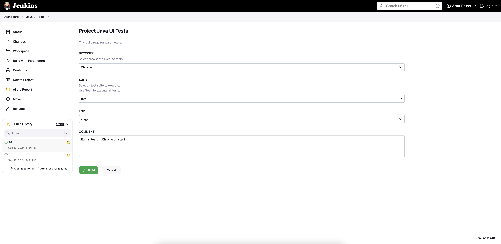
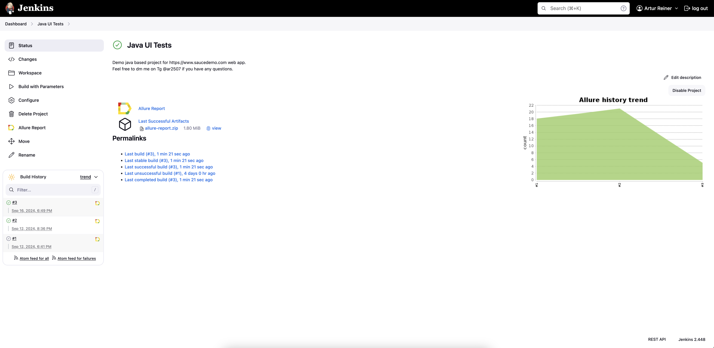
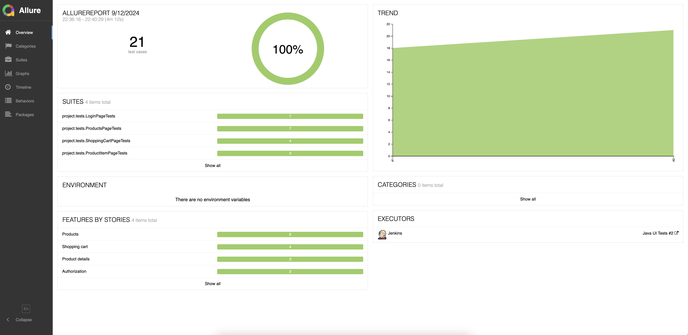
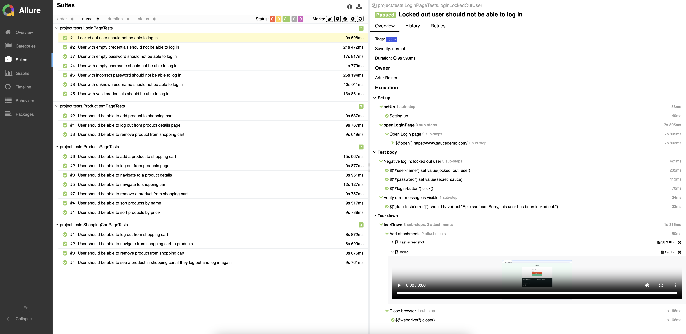
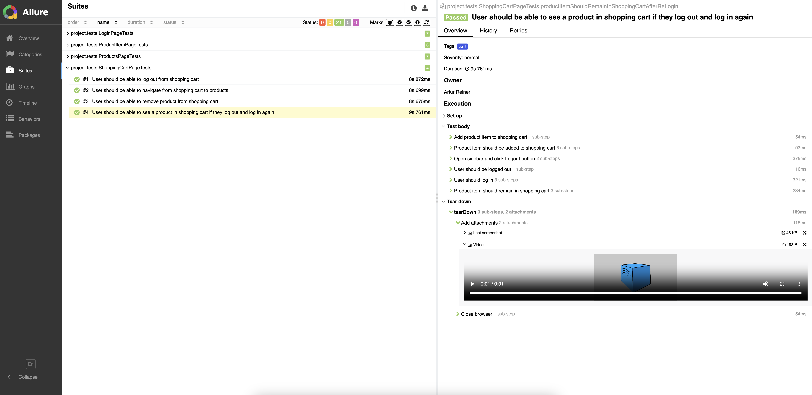
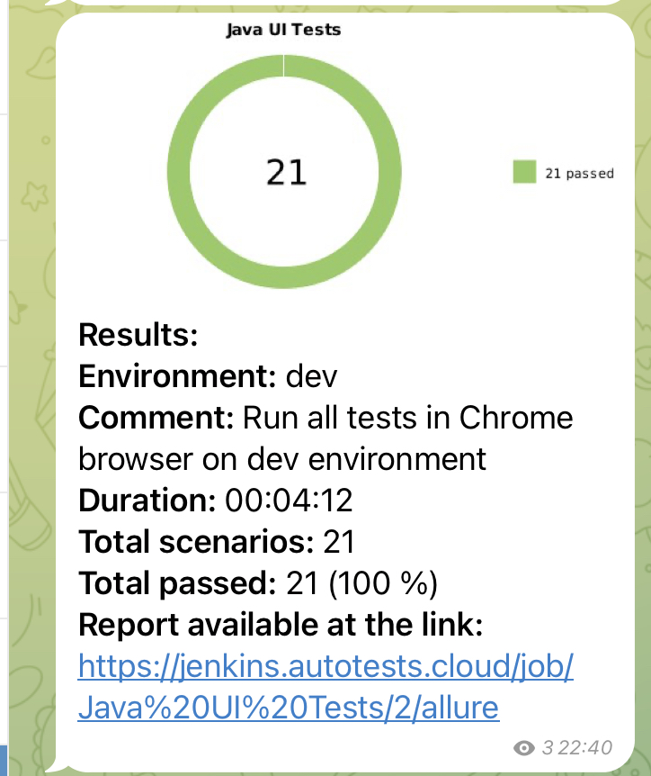
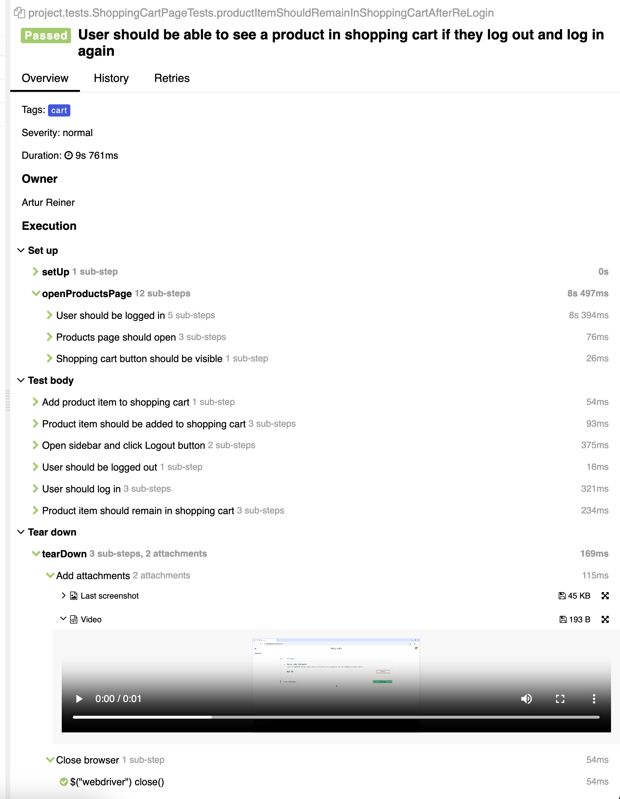
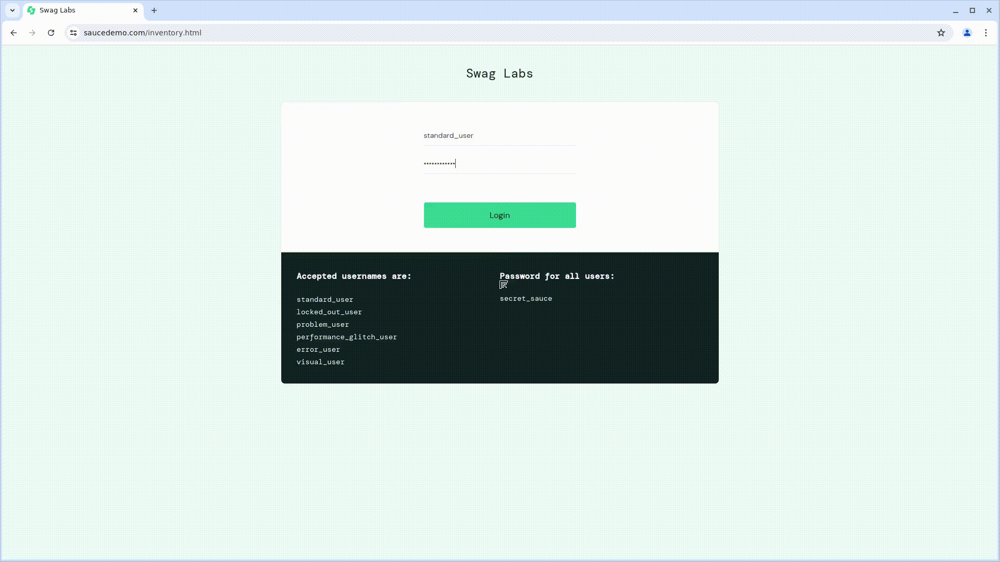

# Dummy automated tests project

---
## :scroll: Content:
+ [Summary](#summary)
+ [Stack](#computer-technical-stack)
+ [Tests](#ballot_box_with_check-tests)
+ [How to run tests](#how-to-run-tests)
+ [Jenkins Job](#jenkins-job)
+ [Allure Report](#allure-report)
+ [Notifications](#notifications)
+ [Test execution video](#test-execution-video)
---

## <a name="summary"></a>Summary
- The project consists of UI tests for a simple web app and is intended to demonstrate (or not 😊) my competencies in automated testing.
- The test were written in `Java`
- The testing frameworks were `Selenide/Selenium` and `JUnit5`
- The build tool used is `Gradle`
- The `Page Object` design pattern was implemented
- The `Owner` library was used to get rid of the boilerplate code in properties based configuration
- The tests can be run locally and remotely
- To run the tests remotely, the `Selenoid` tool was used as an alternative to the `Selenium Hub`
- The integrated with `Jenkins` was implemented
- An `Allure` report is generated upon the completion of every test run. It contains:
  - Test steps and what was verified
  - Screenshots and videos of the test execution

---
## <a name="computer-technical-stack"></a>:computer: Technical Stack
<p align="left">
<a href="https://www.jetbrains.com/idea/"></a> 
<a href="https://www.java.com/"></a>
<a href="https://selenide.org/"></a>
<a href="https://selenium.dev/"></a>
<a href="https://gradle.org/"></a>  
<a href="https://junit.org/junit5/"></a>
<a href="https://aerokube.com/selenoid/"></a>
<a href="https://github.com/allure-framework/allure2"></a>
<a href="https://github.com/"></a>
<a href="https://www.jenkins.io/"></a>   
</p>  

---
## <a name="ballot_box_with_check-tests"></a>:ballot_box_with_check: Tests:
- [x] Correct login using the username and password
- [x] Unsuccessful login with wrong username and password combinations
- [x] Log out
- [x] A product can be added to the shopping cart
- [x] A product can be removed from the cart
- [x] A user can navigate to the product page
- [x] A User can navigate to the shopping cart
- [x] Sorting products by name, price
- [x] The shopping cart must keep the product that a user has added and then logged out

---
## <a name="how-to-run-tests"></a>How To Run Tests

### Properties

* <code>taskName</code>. Test suite to run. Available options are <code>test</code>, <code>smoke</code>, 
<code>login</code>, <code>product</code>, <code>cart</code>. Can be found in <code>build.gradle</code>
* <code>env</code>. Use <code>local|dev|staging</code>. If <code>local</code> then <code>browser.remote</code> is required to be set to <code>false</code>  
* <code>browser.baseUrl</code>. The testing environment url
* <code>browser.browser</code>. Browser, default is chrome. For local runs, use any browser in accordance with your platform. For remote runs, use <code>chrome|firefox</code>
* <code>browser.browserSize</code>. Browser window size, 1920x1080 by default
* <code>browser.remote</code>. Pass <code>true|false</code>. If <code>true</code> then <code>browser.selenoidUrl</code> and <code>browser.videoStorage</code> are required
* <code>browser.selenoidUrl</code>. Selenoid url
* <code>browser.videoStorage</code>. Video storage url, is used to store the tests run videos

_**Example of the command to run tests locally:**_

```
./gradlew clean test -Denv=local -Dbrowser.browser=firefox -Dbrowser.browserSize=1600x800 -Dbrowser.remote=false
```

_**Example of the command to run tests remotely using Selenoid:**_

```
./gradlew clean test -Denv=staging -Dbrowser.browser=chrome -Dbrowser.browserSize=1920x1080 -Dbrowser.remote=true \
-Dbrowser.remoteUrl=${remoteUrl} -Dbrowser.videoStorage=${videoStorageUrl}
```

---
## <a name="jenkins-job"></a>[Jenkins Job](https://jenkins.autotests.cloud/job/Java%20UI%20Tests/) 

<p align="center"></p>
<p align="center"></p>

---
## <a name="allure-report"></a> [Allure Report](https://jenkins.autotests.cloud/job/Java%20UI%20Tests/2/allure/) after each tests run

<p align="center"></p>  
<p align="center"></p>  
<p align="center"></p>  
---

## <a name="notifications"></a>Notifications

<p align="center"></p>

---
## <a name="test-execution-video"></a> Test execution video

Every test in Allure report contains not only a screenshot but also a video of the test execution. For instance, here is a test
<p align="center"></p>

Here is its screencast
<p align="center"></p>

---